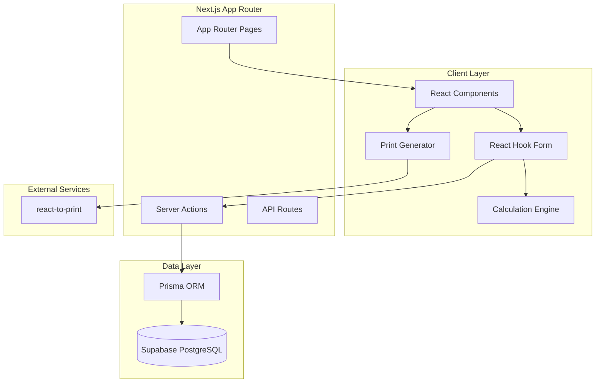

# Design Document: Vehicle Hire Billing System

## Overview

The Vehicle Hire Billing System is a modern, high-performance Next.js 15 application that provides comprehensive billing management for vehicle hire services. The system leverages the App Router architecture with TypeScript for type safety, Prisma ORM for database operations, and a clean, professional UI built with Tailwind CSS and Shadcn UI components.

The application follows a server-first architecture using Next.js Server Actions for data mutations, ensuring optimal performance and user experience. Real-time calculations are handled client-side for immediate feedback, while data persistence occurs server-side for reliability and security.

## Architecture

### High-Level Architecture



### Technology Stack

- **Frontend Framework**: Next.js 15 with App Router and TypeScript
- **Database**: Supabase PostgreSQL with Prisma ORM
- **UI Framework**: Tailwind CSS with Shadcn UI components
- **Form Management**: React Hook Form with Zod validation
- **State Management**: Server Actions for mutations, React state for UI
- **PDF Generation**: react-to-print library
- **Styling**: Modern, professional SaaS-style interface

### Architectural Patterns

1. **Server-First Architecture**: Leverages Next.js Server Actions for data operations
2. **Component-Based Design**: Modular React components with clear separation of concerns
3. **Type-Safe Development**: Full TypeScript integration with Zod schema validation
4. **Reactive Calculations**: Real-time updates using custom hooks and React state
5. **Progressive Enhancement**: Works without JavaScript, enhanced with client-side features

## Components and Interfaces

### Core Components

#### 1. BillCreator Component
```typescript
interface BillCreatorProps {
  onBillCreated: (billId: string) => void;
}

interface BillFormData {
  vehicleNo: string;
  customerName: string;
  route: string;
  startMeter: number;
  endMeter: number;
  hireRate: number;
  waitingCharge: number;
  gatePass: number;
  packageCharge: number;
}
```

**Responsibilities:**
- Render bill creation form with validation
- Handle real-time calculations
- Submit data via Server Actions
- Provide immediate feedback and error handling

#### 2. Dashboard Component
```typescript
interface DashboardProps {
  initialBills: Bill[];
}

interface BillTableRow {
  id: string;
  billNumber: number;
  vehicleNo: string;
  customerName: string;
  route: string;
  totalAmount: number;
  createdAt: Date;
}
```

**Responsibilities:**
- Display searchable table of bills
- Handle filtering and sorting
- Provide navigation to bill details
- Support pagination for large datasets

#### 3. PrintableInvoice Component
```typescript
interface PrintableInvoiceProps {
  bill: Bill;
  companyInfo: CompanyInfo;
}

interface CompanyInfo {
  name: string;
  address: string;
  phone: string;
  email: string;
  logo?: string;
}
```

**Responsibilities:**
- Render professional invoice layout
- Support print and PDF generation
- Maintain consistent branding
- Handle responsive print styles

#### 4. CalculationEngine Hook
```typescript
interface UseCalculationEngineReturn {
  totalAmount: number;
  distance: number;
  baseCharge: number;
  extraCharges: number;
  updateField: (field: string, value: number) => void;
}
```

**Responsibilities:**
- Perform real-time calculations
- Validate calculation inputs
- Provide formatted currency display
- Handle edge cases and error states

### Server Actions

#### 1. createBill Server Action
```typescript
async function createBill(formData: FormData): Promise<ActionResult<string>>
```

**Responsibilities:**
- Validate incoming form data using Zod schemas
- Generate unique bill number
- Persist bill to database via Prisma
- Return bill ID for immediate printing
- Handle database errors gracefully

#### 2. getBills Server Action
```typescript
async function getBills(searchQuery?: string): Promise<ActionResult<Bill[]>>
```

**Responsibilities:**
- Retrieve bills from database with optional filtering
- Support pagination and sorting
- Handle search functionality
- Return formatted bill data

### Utility Functions

#### 1. Validation Schemas
```typescript
const BillSchema = z.object({
  vehicleNo: z.string().min(1, "Vehicle number is required"),
  customerName: z.string().min(1, "Customer name is required"),
  route: z.string().min(1, "Route is required"),
  startMeter: z.number().min(0, "Start meter must be positive"),
  endMeter: z.number().min(0, "End meter must be positive"),
  hireRate: z.number().min(0, "Hire rate must be positive"),
  waitingCharge: z.number().min(0, "Waiting charge must be positive"),
  gatePass: z.number().min(0, "Gate pass must be positive"),
  packageCharge: z.number().min(0, "Package charge must be positive")
}).refine(data => data.endMeter > data.startMeter, {
  message: "End meter must be greater than start meter",
  path: ["endMeter"]
});
```

#### 2. Calculation Utilities
```typescript
function calculateTotalAmount(
  startMeter: number,
  endMeter: number,
  hireRate: number,
  extraCharges: number
): number;

function formatCurrency(amount: number): string;
function calculateDistance(startMeter: number, endMeter: number): number;
```

## Data Models

### Database Schema (Prisma)

```prisma
model Bill {
  id            String   @id @default(cuid())
  billNumber    Int      @unique @default(autoincrement())
  vehicleNo     String
  customerName  String
  route         String
  startMeter    Float
  endMeter      Float
  hireRate      Float
  waitingCharge Float    @default(0)
  gatePass      Float    @default(0)
  packageCharge Float    @default(0)
  totalAmount   Float
  createdAt     DateTime @default(now())
  updatedAt     DateTime @updatedAt

  @@map("bills")
}
```

### Data Model Relationships

The Bill model is designed as a standalone entity with the following characteristics:

- **Primary Key**: CUID for globally unique identifiers
- **Auto-incrementing Bill Number**: Sequential numbering starting from 1
- **Audit Fields**: createdAt and updatedAt for tracking
- **Calculated Fields**: totalAmount stored for performance and audit trail
- **Flexible Numeric Types**: Float for precise decimal calculations

### Data Validation Rules

1. **Required Fields**: vehicleNo, customerName, route, startMeter, endMeter, hireRate
2. **Numeric Constraints**: All meter readings and charges must be non-negative
3. **Business Logic**: endMeter must be greater than startMeter
4. **Data Integrity**: totalAmount calculated and validated on both client and server
5. **Unique Constraints**: billNumber must be unique across all bills

## Correctness Properties

*A property is a characteristic or behavior that should hold true across all valid executions of a system—essentially, a formal statement about what the system should do. Properties serve as the bridge between human-readable specifications and machine-verifiable correctness guarantees.*

Based on the prework analysis of acceptance criteria, the following properties ensure system correctness:

### Property 1: Bill Number Uniqueness and Sequencing
*For any* sequence of bill creation operations, each bill should receive a unique billNumber that auto-increments starting from 1, with no gaps or duplicates.
**Validates: Requirements 1.1**

### Property 2: Total Amount Calculation Correctness
*For any* valid bill data with startMeter, endMeter, hireRate, and extra charges, the totalAmount should equal ((endMeter - startMeter) * hireRate) + waitingCharge + gatePass + packageCharge.
**Validates: Requirements 1.2, 1.3, 7.3, 7.4**

### Property 3: Valid Bill Persistence
*For any* bill that passes validation, submitting it should result in successful database persistence and return a valid bill ID.
**Validates: Requirements 1.4, 5.1**

### Property 4: Invalid Bill Rejection
*For any* bill with missing required fields or invalid data (endMeter < startMeter, non-numeric values), the system should reject submission and display appropriate validation errors.
**Validates: Requirements 1.5, 2.1, 2.2, 2.3**

### Property 5: Validation Schema Consistency
*For any* bill data, both client-side and server-side validation should use identical Zod schemas and produce consistent validation results.
**Validates: Requirements 2.5**

### Property 6: Database Constraint Enforcement
*For any* data operation, the database should enforce proper data types and constraints, rejecting invalid data at the database level.
**Validates: Requirements 2.4**

### Property 7: Print Availability After Creation
*For any* successfully created bill, the print functionality should be immediately available and accessible.
**Validates: Requirements 3.1**

### Property 8: Invoice Content Completeness
*For any* bill, the generated invoice should contain all bill details (vehicleNo, customerName, route, charges, totals) in a properly formatted layout with company header.
**Validates: Requirements 3.2, 3.3**

### Property 9: Print Mode Support
*For any* bill, the print generator should support both PDF generation and direct printing functionality using react-to-print.
**Validates: Requirements 3.5**

### Property 10: Dashboard Search Functionality
*For any* search query on vehicleNo, customerName, or billNumber, the dashboard should return only bills that match the search criteria.
**Validates: Requirements 4.2**

### Property 11: Bill Detail Access
*For any* bill row in the dashboard, clicking it should provide access to view the complete bill details.
**Validates: Requirements 4.3**

### Property 12: Dashboard Sorting Order
*For any* collection of bills, the dashboard should display them in descending order by creation date (newest first).
**Validates: Requirements 4.4**

### Property 13: Database Error Handling
*For any* database operation failure, the server action should return appropriate error messages to the client without exposing sensitive information.
**Validates: Requirements 5.2, 5.5**

### Property 14: Form Submission Feedback
*For any* form submission, the system should provide immediate feedback including loading states and success/error messages.
**Validates: Requirements 6.2**

### Property 15: Validation Error Display
*For any* validation failure, the system should display clear, actionable error messages that help users correct their input.
**Validates: Requirements 6.4**

### Property 16: Currency Formatting Consistency
*For any* calculated monetary value, the system should display it with consistent currency formatting throughout the application.
**Validates: Requirements 7.5**

### Property 17: Error Boundary Protection
*For any* unexpected error or exception, the system should catch it gracefully and provide appropriate user feedback without crashing.
**Validates: Requirements 8.4**

<function_calls>
<invoke name="prework">
<parameter name="featureName">vehicle-hire-billing

## Error Handling

### Client-Side Error Handling

1. **Form Validation Errors**
   - Real-time validation using Zod schemas
   - Field-level error messages with clear guidance
   - Form submission prevention until all errors resolved
   - Visual indicators for invalid fields

2. **Network and Server Errors**
   - Graceful handling of network timeouts
   - User-friendly error messages for server failures
   - Retry mechanisms for transient failures
   - Loading states during operations

3. **Calculation Errors**
   - Input sanitization for numeric fields
   - Graceful handling of edge cases (zero values, empty fields)
   - Fallback values for invalid calculations
   - Clear error messages for invalid meter readings

### Server-Side Error Handling

1. **Database Errors**
   - Connection failure handling with user notification
   - Transaction rollback on operation failures
   - Constraint violation handling with meaningful messages
   - Query timeout handling

2. **Validation Errors**
   - Server-side validation using same Zod schemas
   - Detailed error responses for debugging
   - Input sanitization and SQL injection prevention
   - Type safety enforcement

3. **Business Logic Errors**
   - Bill number collision handling
   - Duplicate submission prevention
   - Data integrity validation
   - Audit trail for error tracking

### Error Boundary Implementation

```typescript
class BillingErrorBoundary extends React.Component {
  // Catch and handle React component errors
  // Provide fallback UI for error states
  // Log errors for monitoring and debugging
}
```

## Testing Strategy

### Dual Testing Approach

The system employs both unit testing and property-based testing for comprehensive coverage:

- **Unit tests**: Verify specific examples, edge cases, and error conditions
- **Property tests**: Verify universal properties across all inputs
- Together they provide comprehensive coverage where unit tests catch concrete bugs and property tests verify general correctness

### Property-Based Testing Configuration

**Testing Library**: Fast-check for TypeScript/JavaScript property-based testing
- Minimum 100 iterations per property test for thorough randomization
- Each property test references its corresponding design document property
- Tag format: **Feature: vehicle-hire-billing, Property {number}: {property_text}**

### Unit Testing Strategy

**Focus Areas for Unit Tests**:
- Specific calculation examples with known inputs/outputs
- Edge cases like zero values, empty strings, boundary conditions
- Error conditions and validation failures
- Integration points between components
- Mock server responses and database operations

**Testing Tools**:
- **Jest**: Primary testing framework
- **React Testing Library**: Component testing
- **MSW (Mock Service Worker)**: API mocking
- **Prisma Test Environment**: Database testing

### Property Test Implementation

Each correctness property will be implemented as a property-based test:

1. **Property 1**: Generate random bill sequences, verify unique incrementing numbers
2. **Property 2**: Generate random valid bill data, verify calculation formula
3. **Property 3**: Generate random valid bills, verify database persistence
4. **Property 4**: Generate random invalid bills, verify rejection and error messages
5. **Property 5**: Generate random bill data, verify client/server validation consistency
6. **Property 6**: Generate random data operations, verify database constraints
7. **Property 7**: Generate random bills, verify print availability after creation
8. **Property 8**: Generate random bills, verify invoice content completeness
9. **Property 9**: Generate random bills, verify both print modes work
10. **Property 10**: Generate random search queries, verify filtering accuracy
11. **Property 11**: Generate random bill collections, verify detail access
12. **Property 12**: Generate random bill collections, verify sorting order
13. **Property 13**: Generate database failure scenarios, verify error handling
14. **Property 14**: Generate random form submissions, verify feedback provision
15. **Property 15**: Generate validation failures, verify error message display
16. **Property 16**: Generate random monetary values, verify formatting consistency
17. **Property 17**: Generate error scenarios, verify graceful error boundary handling

### Integration Testing

**End-to-End Scenarios**:
- Complete bill creation workflow from form to database
- Dashboard search and filtering functionality
- Print generation and PDF creation
- Error handling across component boundaries
- Database connection and recovery scenarios

**Testing Environment**:
- Separate test database with Supabase
- Isolated test environment for each test suite
- Automated cleanup and setup procedures
- Mock external services and dependencies

### Performance Testing

**Key Metrics**:
- Form responsiveness and calculation speed
- Database query performance
- Page load times and bundle sizes
- Print generation performance
- Memory usage and leak detection

**Testing Approach**:
- Automated performance regression testing
- Load testing for concurrent users
- Database query optimization validation
- Bundle size monitoring and optimization