<
2. [Subscription Plans & Pricing](#2-subscription-plans--pricing)
3. [Technology Stack](#3-technology-stack)
4. [System Architecture](#4-system-architecture)
5. [Entity Relationship Diagram](#5-entity-relationship-diagram)
6. [Data Flow Diagrams](#6-data-flow-diagrams)
7. [Use Case Diagram](#7-use-case-diagram)
8. [Class Diagram](#8-class-diagram)
9. [Sequence Diagrams](#9-sequence-diagrams)
10. [State Diagrams](#10-state-diagrams)
11. [Component Architecture](#11-component-architecture)
12. [Database Schema](#12-database-schema)
13. [Server Actions & API Reference](#13-server-actions--api-reference)
14. [User Roles & Permissions](#14-user-roles--permissions)
15. [Feature Documentation](#15-feature-documentation)
16. [Deployment Architecture](#16-deployment-architecture)
17. [Security Features](#17-security-features)
18. [Appendix](#18-appendix)

---

## 1. Executive Summary

**VIGIL** is a cloud-based Smart Travel Management System designed for vehicle hire companies, tour operators, and fleet managers in Sri Lanka. It provides an end-to-end solution for managing the complete lifecycle of tour operations — from quotations and bookings through to billing and financial reporting.

### Core Capabilities

| Capability | Description |
|---|---|
| **Fleet Management** | Register vehicles with specs, pricing modes, and maintenance tracking |
| **Tour Scheduling** | Create multi-day tour itineraries with per-day cost breakdowns |
| **Quotation Engine** | Generate professional quotations with automatic cost calculations |
| **Booking Management** | Track reservations with driver assignment and availability checking |
| **Billing Engine** | Create bills with dual pricing modes (Per-Day Package / Per-Km Flat Rate) |
| **Print System** | A4 professional invoices (Admin) and 58mm thermal receipts (Driver) |
| **Driver Portal** | Mobile-first interface for drivers with tour tracking and expense logging |
| **Dashboard & Analytics** | Real-time revenue tracking, fleet utilization, and activity monitoring |
| **Multi-Currency** | LKR and USD support with configurable exchange rates |

### Target Market
- Vehicle hire companies (cars, vans, SUVs, buses)
- Tour operators and travel agencies
- Corporate fleet managers
- Airport transfer services

---

## 2. Subscription Plans & Pricing

> [!NOTE]
> All prices are in USD. LKR equivalent shown at Rs. 300/USD. Annual plans include a **20% discount**.

### Plan Comparison

| Feature | Starter | Professional | Enterprise |
|---|:---:|:---:|:---:|
| **Monthly Price** | **$15/mo** | **$35/mo** | **$75/mo** |
| **Annual Price** | **$144/yr** ($12/mo) | **$336/yr** ($28/mo) | **$720/yr** ($60/mo) |
| **LKR Monthly** | Rs. 4,500 | Rs. 10,500 | Rs. 22,500 |
| **LKR Annual** | Rs. 43,200/yr | Rs. 100,800/yr | Rs. 216,000/yr |
| Vehicles | Up to **5** | Up to **20** | **Unlimited** |
| Admin Users | 1 | 3 | Unlimited |
| Driver Accounts | 2 | 10 | Unlimited |
| Bills per Month | 50 | 200 | Unlimited |
| Quotations per Month | 20 | 100 | Unlimited |
| Tour Schedules | 10 | 50 | Unlimited |
| Customer Records | 100 | 500 | Unlimited |
| Booking Management | ✅ | ✅ | ✅ |
| Thermal Printing | ✅ | ✅ | ✅ |
| A4 Invoice Printing | ✅ | ✅ | ✅ |
| Bluetooth Printing | ❌ | ✅ | ✅ |
| Driver Mobile Portal | ❌ | ✅ | ✅ |
| Trip Activity Logging | ❌ | ✅ | ✅ |
| Vehicle Expense Tracking | Basic | Full | Full |
| Maintenance Alerts | ❌ | ✅ | ✅ |
| Dashboard Analytics | Basic | Advanced | Advanced |
| Multi-Currency (USD) | ❌ | ✅ | ✅ |
| Custom Branding (Logo) | ❌ | ✅ | ✅ |
| Bank Details on Quotes | ❌ | ✅ | ✅ |
| Sentry Error Monitoring | ❌ | ❌ | ✅ |
| Priority Support | Email | Email + Chat | Dedicated Account Manager |
| Data Retention | 1 Year | 3 Years | Unlimited |
| **Free Trial** | **14 Days** | **14 Days** | **30 Days** |

### Pricing Diagram

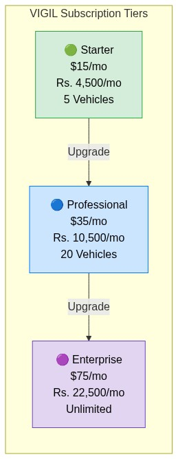

---

## 3. Technology Stack

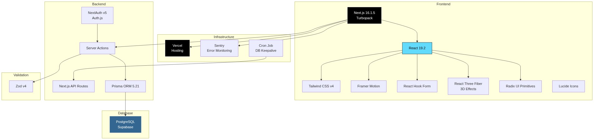

| Layer | Technology | Version | Purpose |
|---|---|---|---|
| **Runtime** | Next.js (Turbopack) | 16.1.5 | Full-stack React framework |
| **UI Library** | React | 19.2.3 | Component rendering |
| **Styling** | Tailwind CSS | v4 | Utility-first CSS |
| **Animations** | Framer Motion | 12.36 | Page transitions, micro-animations |
| **3D Effects** | React Three Fiber | 8.15 | Aurora background effects |
| **Forms** | React Hook Form | 7.71 | Form state management |
| **Validation** | Zod | 4.3 | Schema validation (client + server) |
| **Auth** | NextAuth (Auth.js) | v5-beta | Session management, credentials provider |
| **ORM** | Prisma | 5.21 | Database queries, migrations |
| **Database** | PostgreSQL | — | Supabase-hosted |
| **Hosting** | Vercel | — | Serverless deployment |
| **Monitoring** | Sentry | 10.42 | Error tracking, performance |
| **Printing** | react-to-print | 3.2 | Browser print API |
| **Icons** | Lucide React | 0.563 | SVG icon library |
| **Password** | bcryptjs | 3.0 | Password hashing |
| **Dates** | date-fns | 4.1 | Date manipulation |

---

## 4. System Architecture

### High-Level Architecture

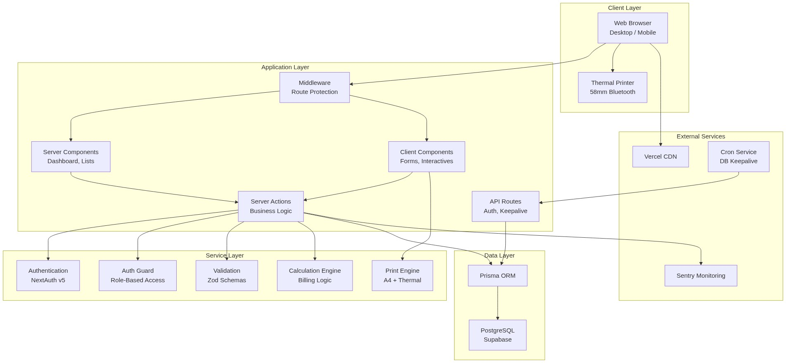

### Request Flow

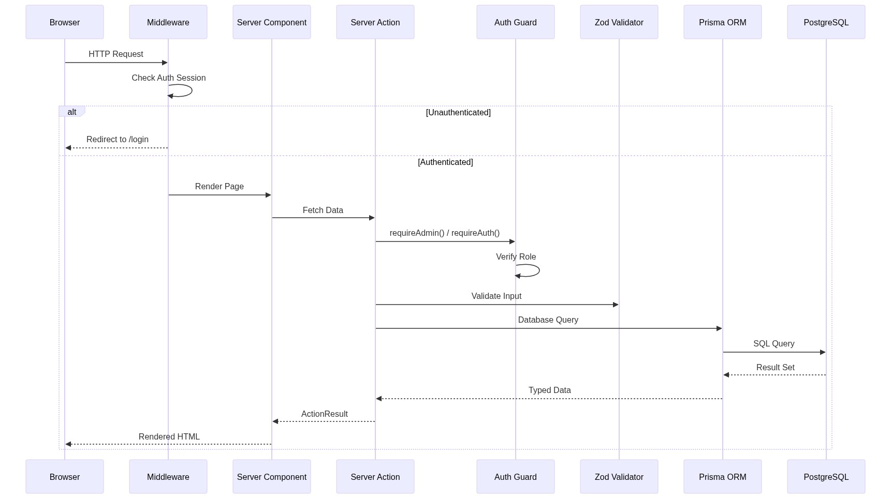

---

## 5. Entity Relationship Diagram

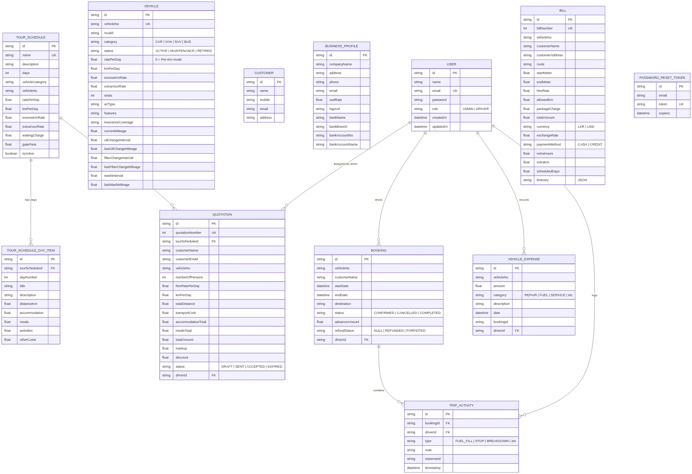

---

## 6. Data Flow Diagrams

### Level 0 — Context Diagram

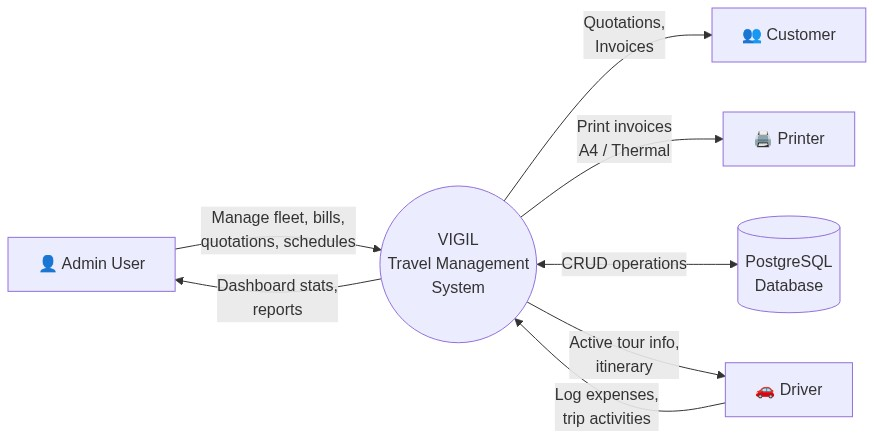

### Level 1 — Major Processes

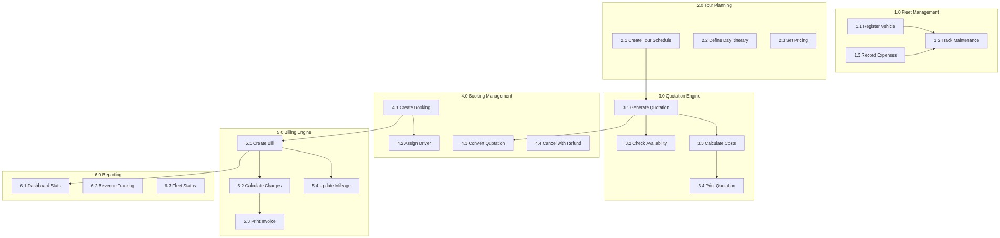

### Level 2 — Billing Process Detail

---

## 7. Use Case Diagram

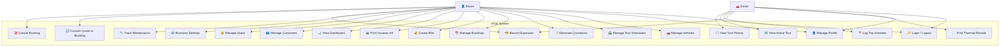

---

## 8. Class Diagram

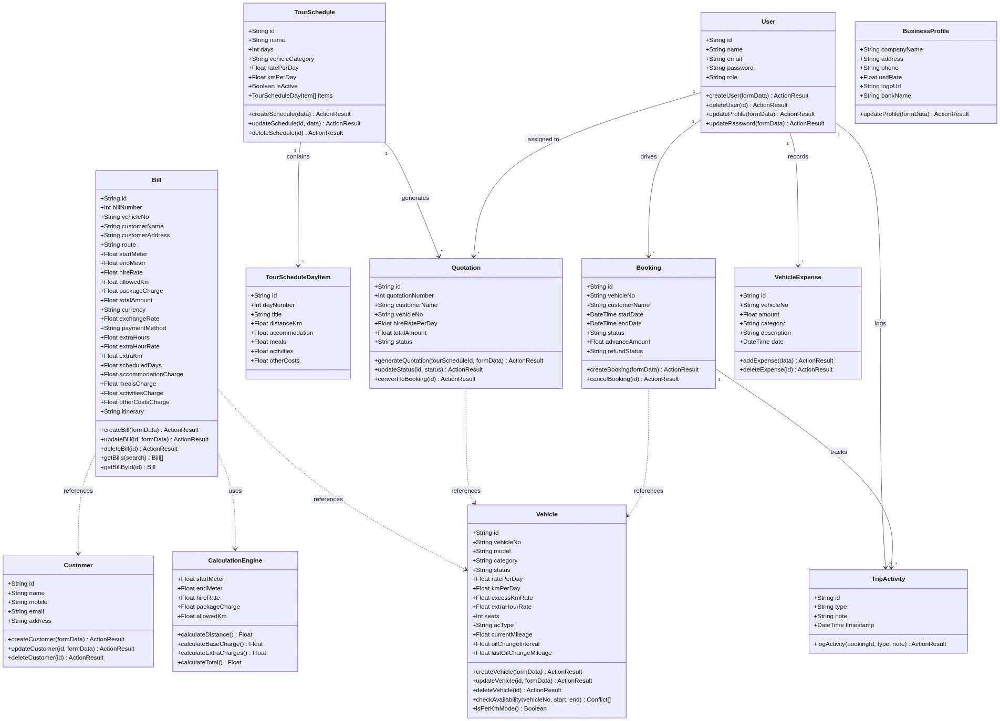

---

## 9. Sequence Diagrams

### 9.1 Quotation to Booking to Bill Flow

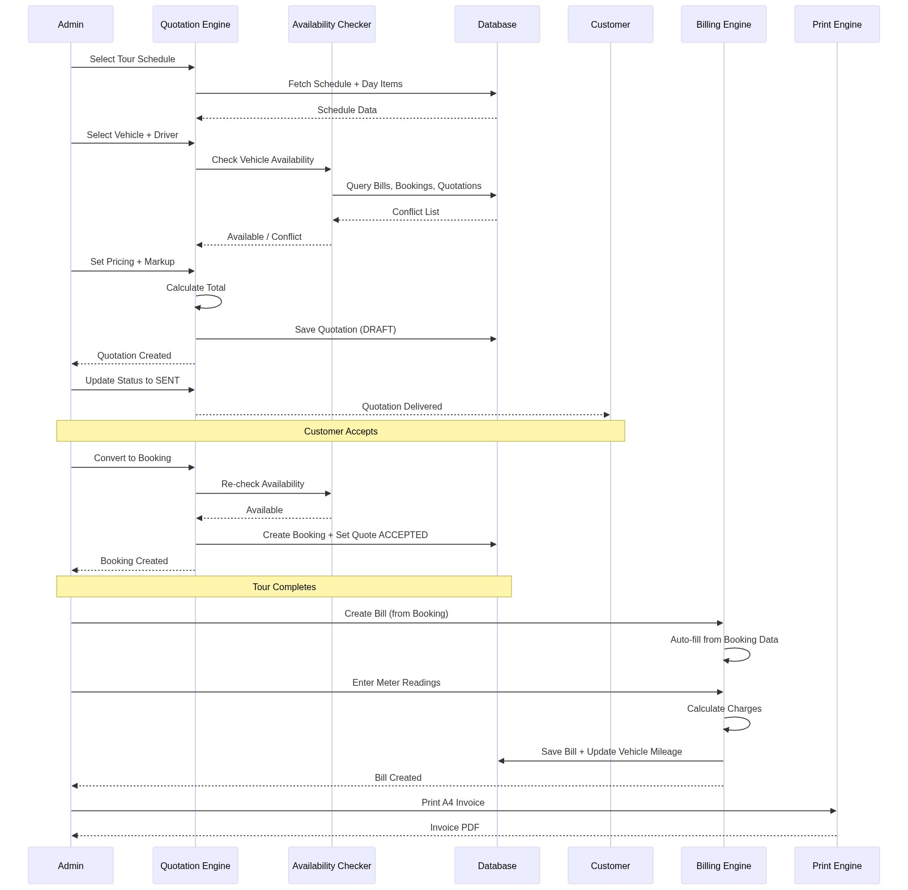

### 9.2 Bill Creation with Per-Km Pricing

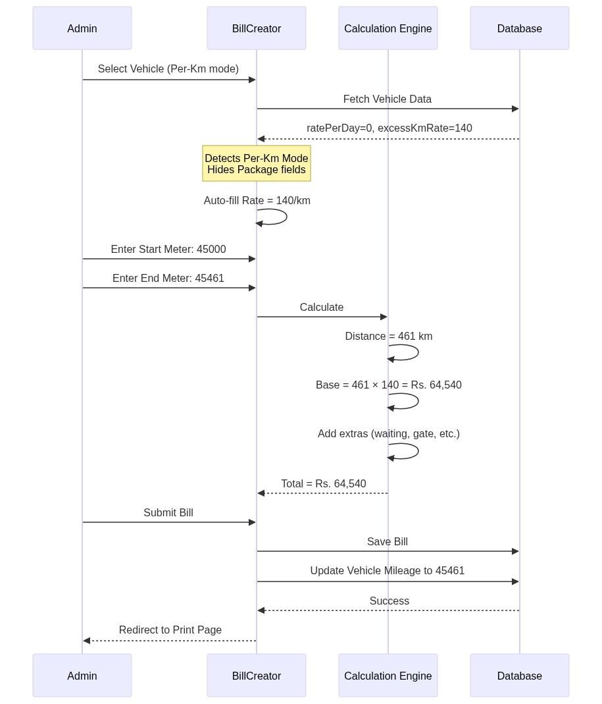

### 9.3 Driver Trip Activity Flow

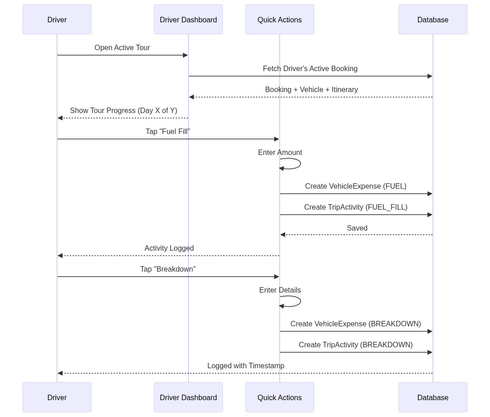

### 9.4 Authentication Flow

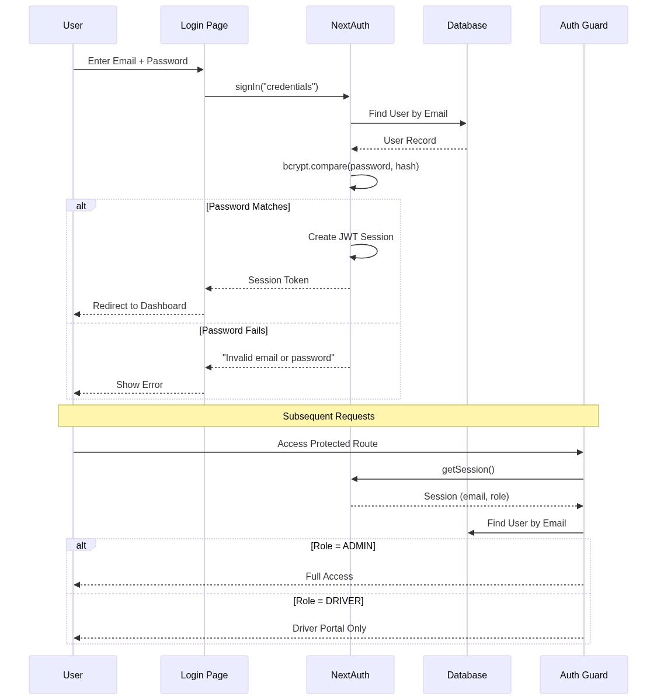

---

## 10. State Diagrams

### 10.1 Quotation Lifecycle

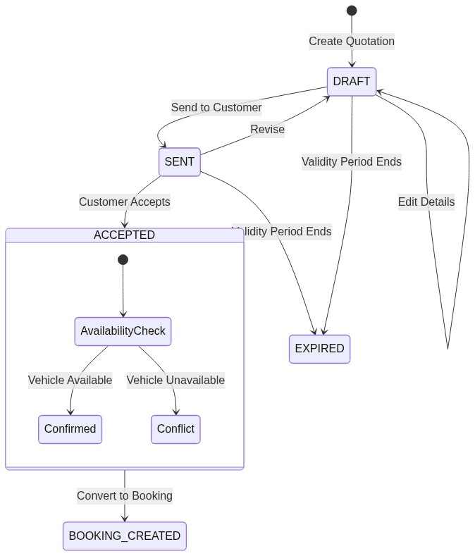

### 10.2 Booking Lifecycle

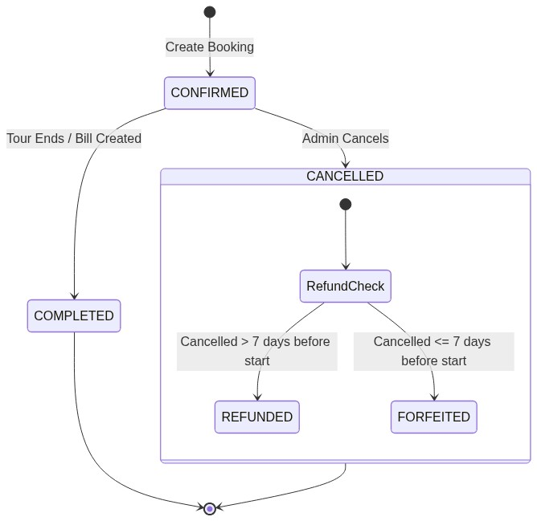

### 10.3 Vehicle Status

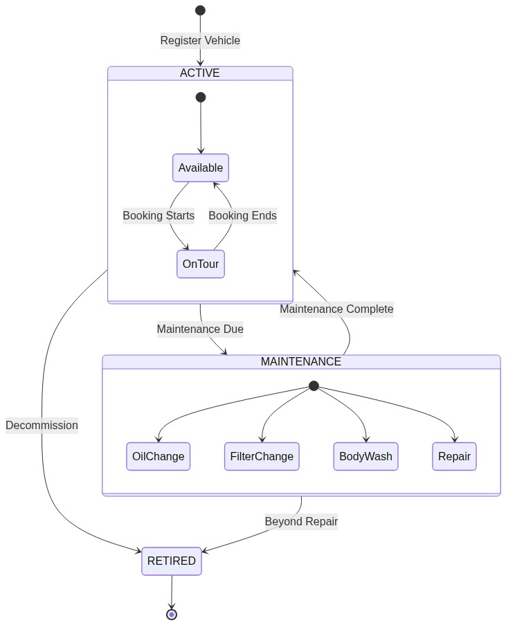

### 10.4 Bill Pricing Mode

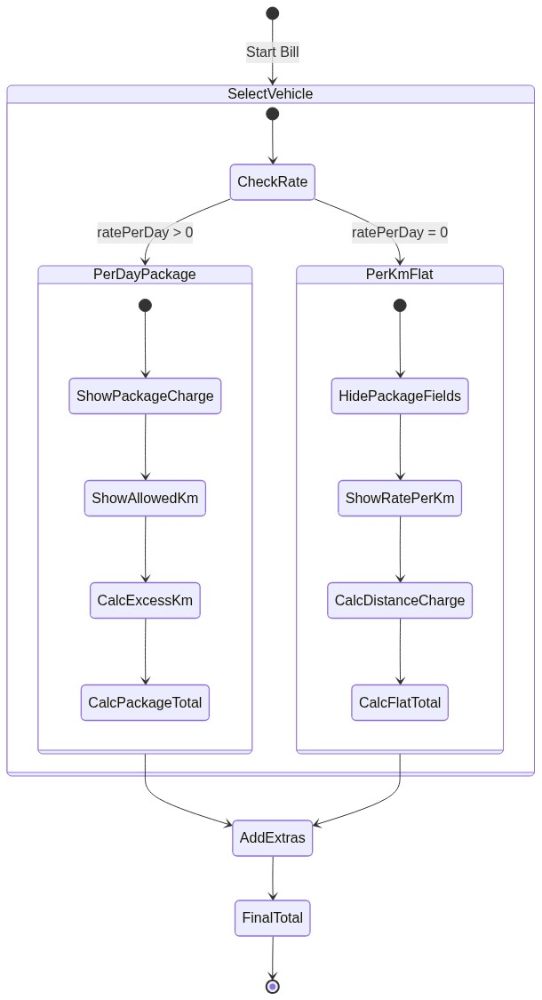

---

## 11. Component Architecture

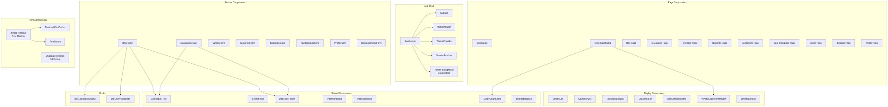

---

## 12. Database Schema

### 12.1 Complete Model Reference

> [!IMPORTANT]
> **11 database models** stored in PostgreSQL via Prisma ORM. No Prisma enums are used — all enums are application-level strings validated by Zod schemas.

#### Bill Model
| Field | Type | Default | Description |
|---|---|---|---|
| id | String | cuid() | Primary key |
| billNumber | Int | autoincrement | Unique sequential bill number |
| vehicleNo | String | — | Vehicle registration number |
| customerName | String | — | Customer full name |
| customerAddress | String? | — | Customer address |
| route | String | — | Tour route description |
| startMeter | Float | — | Odometer at trip start |
| endMeter | Float | — | Odometer at trip end |
| hireRate | Float | — | Rate per km (excess or flat) |
| allowedKm | Float | 0 | Included km in package |
| waitingCharge | Float | 0 | Waiting charges |
| gatePass | Float | 0 | Gate/toll fees |
| packageCharge | Float | 0 | Base package charge (0 for per-km) |
| advanceAmount | Float | 0 | Advance payment received |
| totalAmount | Float | — | Calculated total amount |
| currency | String | "LKR" | LKR or USD |
| exchangeRate | Float | 1.0 | USD to LKR rate |
| totalAmountLKR | Float | 0 | Amount in LKR |
| paymentMethod | String | "CASH" | CASH or CREDIT |
| startDate | DateTime | now() | Trip start date/time |
| endDate | DateTime | now() | Trip end date/time |
| extraHours | Float | 0 | Hours beyond scheduled |
| extraHourRate | Float | 0 | Charge per extra hour |
| extraKm | Float | 0 | Km beyond package allowance |
| scheduledDays | Float | 1 | Number of tour days |
| accommodationCharge | Float | 0 | Total accommodation cost |
| mealsCharge | Float | 0 | Total meals cost |
| activitiesCharge | Float | 0 | Total activities cost |
| otherCostsCharge | Float | 0 | Miscellaneous costs |
| itinerary | String? | — | JSON snapshot of day items |

#### Vehicle Model
| Field | Type | Default | Description |
|---|---|---|---|
| id | String | cuid() | Primary key |
| vehicleNo | String | — | Unique registration number |
| model | String? | — | Vehicle make/model |
| category | String | "CAR" | CAR, VAN, SUV, BUS, LORRY |
| status | String | "ACTIVE" | ACTIVE, MAINTENANCE, RETIRED |
| ratePerDay | Float | 0 | Daily hire rate (0 = Per-Km mode) |
| kmPerDay | Float | 0 | Included km per day in package |
| excessKmRate | Float | 0 | Rate per km (excess or flat) |
| extraHourRate | Float | 0 | Charge per extra hour |
| seats | Int? | — | Passenger capacity |
| acType | String? | — | AC type description |
| features | String? | — | Feature list (free text) |
| insuranceCoverage | String? | — | Insurance details |
| currentMileage | Float | 0 | Current odometer reading |
| oilChangeInterval | Float | 5000 | Km between oil changes |
| lastOilChangeMileage | Float | 0 | Mileage at last oil change |
| filterChangeInterval | Float | 10000 | Km between filter changes |
| lastFilterChangeMileage | Float | 0 | Mileage at last filter change |
| washInterval | Float | 1000 | Km between body washes |
| lastWashMileage | Float | 0 | Mileage at last wash |

*(Full schema for all 11 models documented in the ER Diagram section above)*

---

## 13. Server Actions & API Reference

### 13.1 Bill Actions

| Action | Auth | Parameters | Returns | Description |
|---|---|---|---|---|
| `createBill` | Admin | FormData | `ActionResult<string>` | Creates bill, calculates total, updates vehicle mileage, auto-closes booking |
| `updateBill` | Admin | id, FormData | `ActionResult<string>` | Updates bill and recalculates total |
| `deleteBill` | Admin | id | `ActionResult<null>` | Permanently deletes bill |
| `getBills` | Public | searchQuery? | `Bill[]` | Search by billNumber, vehicleNo, customerName, route |
| `getBillById` | Public | id | `Bill` | Fetch single bill |

### 13.2 Vehicle Actions

| Action | Auth | Parameters | Returns | Description |
|---|---|---|---|---|
| `createVehicle` | Admin | FormData | `ActionResult<string>` | Register new vehicle with maintenance tracking |
| `updateVehicle` | Admin | id, FormData | `ActionResult<string>` | Update vehicle details |
| `deleteVehicle` | Admin | id | `ActionResult<null>` | Delete (blocked if has expenses) |
| `getVehicles` | Public | searchQuery? | `Vehicle[]` | Search by vehicleNo, model |
| `checkVehicleAvailability` | Public | vehicleNo, start, end | `Conflict[]` | Check against Bills, Bookings, Quotations |

### 13.3 Quotation Actions

| Action | Auth | Parameters | Returns | Description |
|---|---|---|---|---|
| `generateQuotation` | Admin | tourScheduleId, FormData | `ActionResult<string>` | Auto-calculates totals from schedule |
| `updateQuotation` | Auth | id, tourScheduleId, FormData | `ActionResult<string>` | Update with availability check |
| `updateQuotationStatus` | Public | id, status | `ActionResult<null>` | Change DRAFT/SENT/ACCEPTED/EXPIRED |
| `convertQuotationToBooking` | Admin | quotationId | `ActionResult<string>` | Atomic conversion with availability check |
| `deleteQuotation` | Admin | id | `ActionResult<null>` | Permanently delete |

### 13.4 Booking Actions

| Action | Auth | Parameters | Returns | Description |
|---|---|---|---|---|
| `createBooking` | Auth | FormData | `ActionResult<string>` | Create with vehicle availability check |
| `cancelBooking` | Admin | id | `ActionResult<null>` | Cancel with refund policy (>7 days = REFUNDED, ≤7 = FORFEITED) |
| `getBookings` | Public | searchQuery? | `Booking[]` | Search by vehicleNo, customerName, destination |

### 13.5 Tour Schedule Actions

| Action | Auth | Parameters | Returns | Description |
|---|---|---|---|---|
| `createTourSchedule` | Admin | data | `ActionResult<string>` | Create schedule + day items in transaction |
| `updateTourSchedule` | Admin | id, data | `ActionResult<string>` | Update with delete/recreate of day items |
| `deleteTourSchedule` | Admin | id | `ActionResult<null>` | Soft delete (isActive = false) |

### 13.6 Expense & Activity Actions

| Action | Auth | Parameters | Returns | Description |
|---|---|---|---|---|
| `addVehicleExpense` | Auth | data | `ActionResult<string>` | Drivers need active booking for vehicle; auto-updates maintenance mileage |
| `logTripActivity` | Auth | bookingId, type, note? | `ActionResult<string>` | Driver must be assigned to booking |
| `getDriverTourHistory` | Auth | type | `Booking[]` | Upcoming or completed tours (max 20) |

### 13.7 API Routes

| Route | Method | Auth | Description |
|---|---|---|---|
| `/api/auth/[...nextauth]` | ALL | — | NextAuth authentication endpoints |
| `/api/keepalive` | GET | — | Lightweight DB ping to prevent Supabase pause |

---

## 14. User Roles & Permissions

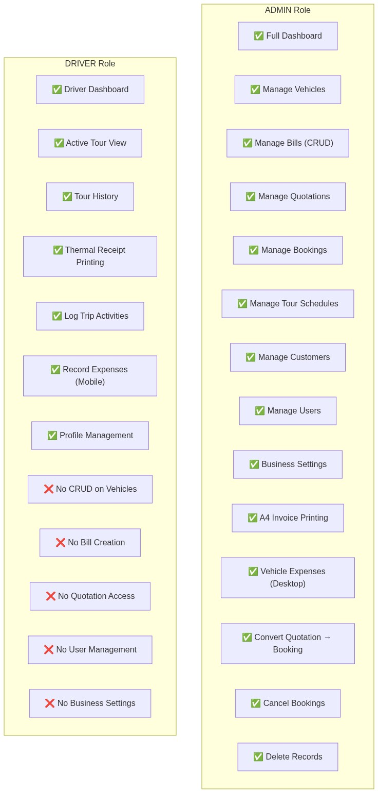

### Permission Matrix

| Feature | Admin | Driver |
|---|:---:|:---:|
| Login / Profile | ✅ | ✅ |
| Dashboard (Full) | ✅ | ❌ |
| Dashboard (Driver) | ❌ | ✅ |
| Create/Edit/Delete Bills | ✅ | ❌ |
| Print A4 Invoice | ✅ | ❌ |
| Print Thermal Receipt | ✅ | ✅ |
| Create/Edit Quotations | ✅ | ❌ |
| Print Quotations | ✅ | ❌ |
| Create/Cancel Bookings | ✅ | ❌ |
| View Bookings | ✅ | ✅ (own) |
| Manage Vehicles | ✅ | ❌ |
| Manage Tour Schedules | ✅ | ❌ |
| Manage Customers | ✅ | ❌ |
| Manage Users | ✅ | ❌ |
| Business Settings | ✅ | ❌ |
| Record Expenses | ✅ | ✅ (own vehicle) |
| Log Trip Activities | ✅ | ✅ (assigned tours) |
| View Tour History | ✅ | ✅ (own) |
| Bluetooth Printing | ✅ | ✅ |

---

## 15. Feature Documentation

### 15.1 Dual Pricing Modes

VIGIL supports two distinct vehicle pricing modes:

**Per-Day Package Mode** (`ratePerDay > 0`)
- Vehicle has a daily hire rate (e.g., Rs. 15,000/day)
- Includes a km allowance per day (e.g., 100 km/day)
- Excess km charged at a separate rate
- Suitable for tour packages with predictable daily pricing

**Per-Km Flat Rate Mode** (`ratePerDay = 0`)
- Vehicle charges purely based on distance traveled
- Rate per km applied to total trip distance
- No package charge or km allowance
- Suitable for airport transfers, point-to-point trips

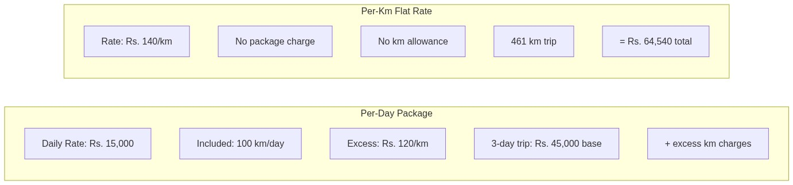

### 15.2 Calculation Engine

The billing calculation engine follows a **3-tier priority system**:

| Priority | Condition | Formula |
|---|---|---|
| **1. Tour Distance Mode** | `totalTourDistance > 0` | `extraKm × hireRate` |
| **2. Package Mode** | `allowedKm > 0 && packageCharge > 0` | `excessKm × hireRate` (excess only) |
| **3. Flat Rate Mode** | Default | `totalDistance × hireRate` |

**Extra Charges** (added to all modes):
`waitingCharge + gatePass + packageCharge + (extraHours × extraHourRate) + accommodation + meals + activities + otherCosts`

### 15.3 Vehicle Maintenance Tracking

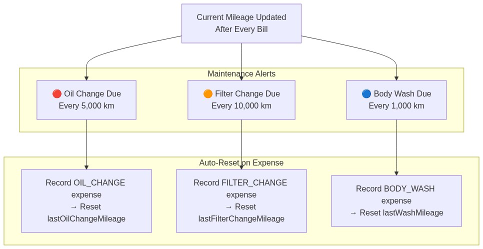

### 15.4 Availability Checking

The system performs real-time availability checking across three data sources:

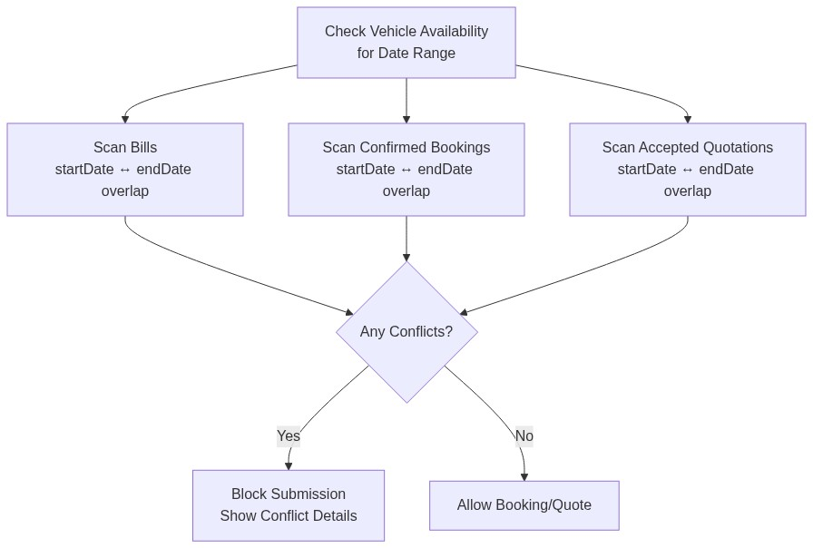

### 15.5 Print System

| Format | Target User | Size | Features |
|---|---|---|---|
| **A4 Portrait Invoice** | Admin | 190mm × ~270mm | Company header, trip details, calculation table, signatures, "Powered by Bitgard" footer |
| **58mm Thermal Receipt** | Driver | 58mm width | Compact layout, large balance text, Bluetooth print support |
| **A4 Quotation** | Admin → Customer | 190mm × ~270mm | Vehicle specs panel, day-by-day itinerary table, cost summary, bank details, terms |

### 15.6 Refund Policy

---

## 16. Deployment Architecture

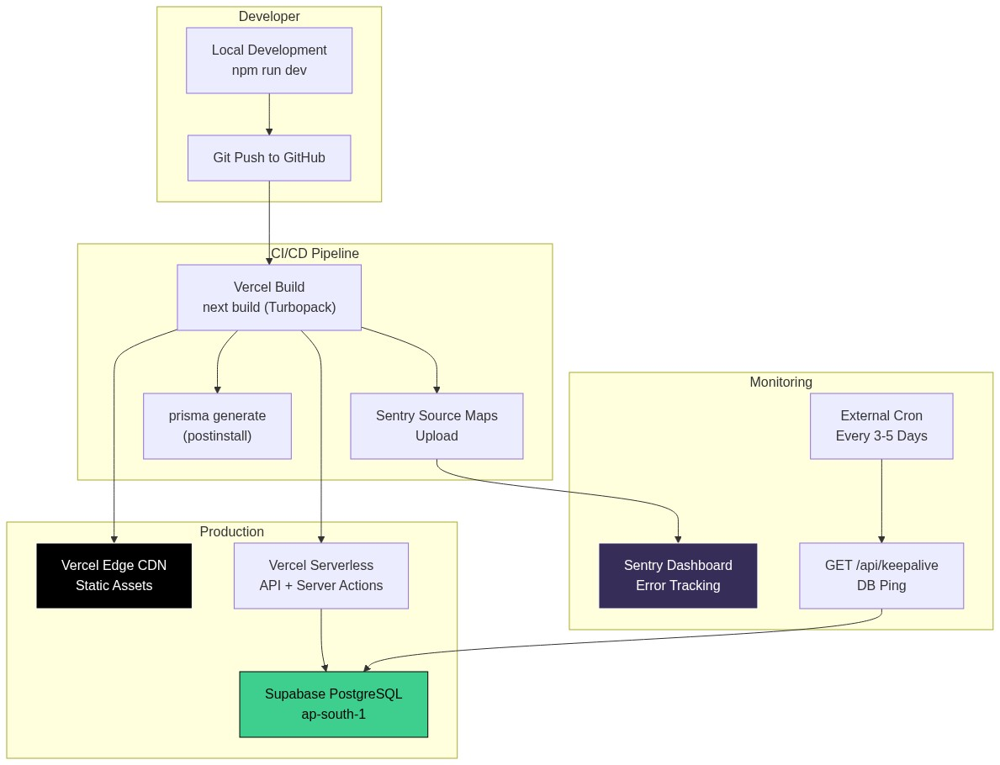

### Environment Variables

| Variable | Description |
|---|---|
| `DATABASE_URL` | PostgreSQL connection string (Supabase) |
| `AUTH_SECRET` | NextAuth JWT signing secret |
| `NEXT_PUBLIC_APP_URL` | Public application URL |

### Security Headers (Applied to All Routes)

| Header | Value |
|---|---|
| X-Frame-Options | SAMEORIGIN |
| X-Content-Type-Options | nosniff |
| Referrer-Policy | origin-when-cross-origin |
| X-XSS-Protection | 1; mode=block |
| Permissions-Policy | camera=(), microphone=(), geolocation=() |
| Strict-Transport-Security | max-age=31536000; includeSubDomains |

---

## 17. Security Features

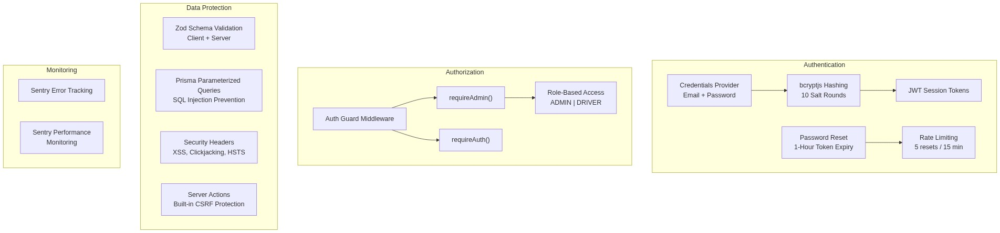

### Security Checklist

| Security Measure | Status | Implementation |
|---|:---:|---|
| Password Hashing | ✅ | bcryptjs with 10 rounds |
| JWT Sessions | ✅ | NextAuth v5 |
| Role-Based Access | ✅ | Auth Guard pattern |
| Input Validation | ✅ | Zod v4 (dual client/server) |
| SQL Injection Prevention | ✅ | Prisma parameterized queries |
| XSS Protection | ✅ | Security headers + React escaping |
| CSRF Protection | ✅ | Next.js Server Actions |
| Clickjacking Prevention | ✅ | X-Frame-Options: SAMEORIGIN |
| HTTPS Enforcement | ✅ | HSTS header (1 year) |
| Rate Limiting | ✅ | Password reset endpoint |
| Error Monitoring | ✅ | Sentry integration |
| Permission Policy | ✅ | No camera/mic/geo access |

---

## 18. Appendix

### A. Expense Categories

| Category | Icon | Color | Description |
|---|---|---|---|
| REPAIR | 🔧 | Red | General vehicle repairs |
| BREAKDOWN | ⚠️ | Orange | Roadside breakdowns |
| FUEL | ⛽ | Blue | Fuel fills |
| SERVICE | 🛠️ | Purple | Scheduled servicing |
| OIL_CHANGE | 💧 | Amber | Oil change (resets maintenance counter) |
| FILTER_CHANGE | 🔲 | Teal | Filter replacement (resets counter) |
| BODY_WASH | 🚿 | Cyan | Vehicle body wash (resets counter) |
| OTHER | 📋 | Gray | Miscellaneous expenses |

### B. Trip Activity Types

| Type | Description |
|---|---|
| FUEL_FILL | Driver refueled the vehicle |
| FLAT_TIRE | Tire puncture/replacement |
| STOP | Unscheduled stop |
| HOTEL_CHECKIN | Hotel check-in for overnight stay |
| RESUME | Resumed journey after stop |
| BREAKDOWN | Vehicle breakdown event |
| NOTE | General driver note |

### C. Vehicle Categories

| Category | Typical Use |
|---|---|
| CAR | Airport transfers, small tours (4 pax) |
| VAN | Group tours, family trips (14 pax) |
| SUV | Safari, luxury tours (7 pax) |
| BUS | Large group tours (40+ pax) |
| LORRY | Equipment transport |

### D. Payment Methods

| Method | Description |
|---|---|
| CASH | Cash payment on completion |
| CREDIT | Credit/deferred payment |

### E. Currency Support

| Currency | Code | Exchange Rate |
|---|---|---|
| Sri Lankan Rupee | LKR | 1.0 (base) |
| US Dollar | USD | Configurable (default: 300.0) |

---

> **Document Version:** 1.0  
> **Generated:** July 2026  
> **System:** VIGIL Smart Travel Management  
> **Developer:** Bitgard PVT LTD  
> **Contact:** +94 70 563 3969  

---

*This document is confidential and intended for internal use and prospective clients only. Subscription pricing is subject to change.*
]]>
